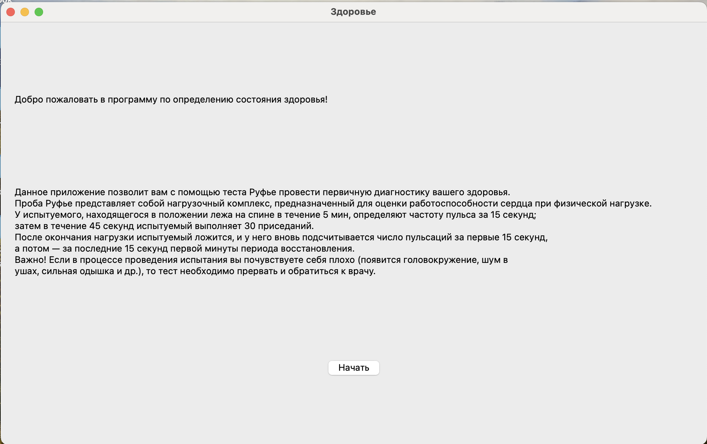
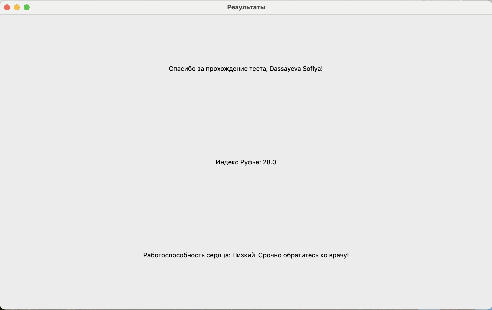

# Index Ruffier Desktop Application

## Overview
The **Index Ruffier Desktop Application** is a PyQt5-based software designed to evaluate **heart performance** using the **Ruffier Test**. It helps users assess their **cardiovascular endurance** by performing a guided physical activity test and analyzing their heart rate. This project was developed to promote heart health awareness and prevent cardiovascular incidents.

## Why This Project?
- Inspired by the **increasing cases of heart-related incidents** among students during physical activities.
- Provides an **accessible, non-invasive** method to estimate **cardiac efficiency**.
- Helps classify users into appropriate **physical fitness groups**.

## Features
✔️ **Step-by-step guided test** with automatic timers
✔️ **Pulse measurement before, during, and after exercise**
✔️ **Automated Ruffier Index calculation**
✔️ **Personalized health evaluation based on age**
✔️ **Easy-to-use graphical interface (PyQt5)**
✔️ **Real-time feedback on heart performance**
✔️ **Error handling for incorrect user inputs**

## Installation
### Requirements
Ensure you have **Python 3.9+** installed. Install dependencies with:
```sh
pip install PyQt5
```

### Running the Application
To launch the application, run:
```sh
python my_app.py
```

## Usage Guide
1. **Enter personal information** (name, age).
2. **Follow the instructions**:
   - Measure pulse **before exercise** (15 sec timer).
   - Perform **30 squats in 45 seconds**.
   - Measure pulse **twice after exercise** (first 15 sec and last 15 sec of the first recovery minute).
3. **Submit results** to calculate **Ruffier Index**.
4. **Receive a heart efficiency rating** based on your Ruffier Index and age.

## Code Structure
- **`my_app.py`** - Main application window (welcome screen & navigation).
- **`second_win.py`** - Test execution screen (input fields & timers).
- **`final_win.py`** - Results screen (calculates Ruffier Index & displays evaluation).
- **`instr.py`** - Contains UI text labels and explanations.

## Ruffier Index Calculation
The **Ruffier Index (IR)** is calculated as:
```python
IR = (4 * (P1 + P2 + P3) - 200) / 10
```
Where:
- **P1** = Pulse rate before exercise (15 seconds measurement)
- **P2** = Pulse rate immediately after squats (15 seconds measurement)
- **P3** = Pulse rate after a short rest (15 seconds measurement)

### Heart Performance Levels
| Ruffier Index | Heart Performance |
|--------------|------------------|
| **≥ 21** | Low - Urgent medical consultation required ⚠️ |
| **17 - 20.9** | Satisfactory - Further evaluation needed ⚠️ |
| **12 - 16.9** | Medium - Consider improving cardiovascular fitness 🏃 |
| **6.5 - 11.9** | Above average - Good heart performance 💪 |
| **≤ 6.4** | Excellent - Optimal heart health 🏆 |

## Example Code Snippets
### **1. Timer Functionality**
Used for tracking user pulse timing during different test stages.
```python
def timer_test(self):
    global time
    time = QTime(0, 0, 15)
    self.timer = QTimer()
    self.timer.timeout.connect(self.update_timer)
    self.timer.start(1000)

def update_timer(self):
    global time
    time = time.addSecs(-1)
    self.text_timer.setText(time.toString('hh:mm:ss'))
    if time.toString('hh:mm:ss') == "00:00:00":
        self.timer.stop()
```

### **2. Handling User Input and Starting Test**
```python
def next_click(self):
    self.tw = TestWin()
    self.hide()
```
This ensures the transition from the welcome screen to the test interface.

### **3. Calculating and Displaying Results**
```python
class FinalWin(QWidget):
    def __init__(self, experiment):
        super().__init__()
        self.experiment = experiment
        self.initUI()
        self.set_appear()
        self.show()

    def results(self):
        if self.experiment.age < 7:
            return 'нет данных для этого возраста' 
        self.index_rufie = (4 * (int(self.experiment.test1) + int(self.experiment.test2) + int(self.experiment.test3)) - 200) / 10
        return self.get_performance_level()

    def get_performance_level(self):
        if self.index_rufie >= 21:
            return level1
        elif self.index_rufie < 21 and self.index_rufie >= 17:
            return level2
        elif self.index_rufie < 17 and self.index_rufie >= 12:
            return level3
        elif self.index_rufie < 12 and self.index_rufie >= 6.5:
            return level4
        else:
            return level5
```

## Screenshots



## Screenrecording 
[App Demo](imgs/screen-recording.gif)

## Advantages Over Similar Applications
- **Offline functionality** - No internet required.
- **Simple UI with clear instructions** - No medical expertise needed.
- **Personalized assessment by age** - More precise than generic fitness apps.
- **Visual & real-time feedback** - Immediate understanding of test results.
- **Automatic error handling** - Prevents incorrect data input.

## Future Improvements
🚀 **Mobile App Development** - Expand to Android/iOS.
🎨 **UI Enhancements** - Improve design for better user experience.
📊 **Data Logging** - Store past results for trend analysis.
💡 **AI-Powered Suggestions** - Provide personalized fitness recommendations.

## License
This project is **open-source** and free for **non-commercial** use.

## Author
Developed by **Sofiya Dassayeva**.

